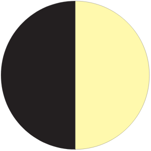

# To add Dark Mode to any new pages

## Step 1
Replace the following code:
```html
<header>
        <h1>BeeDev Services Helper Website</h1>
        <nav-component></nav-component>
</header>
```
with the following
```html
<!-- dark mode switch -->
        <div id="darkModeStyling">
            <h1>BeeDev Services Helper Website</h1>
            <p>
                
            </p>
        </div>
        <header>
            <!-- nav bar start here -->
            <nav-component></nav-component>
        </header>
```
Make sure to map the image correctly depending on where your file is located

## Step 2
Add the following to the head tag:
```html
<link rel="stylesheet" type='text/css' href="./css/dark-mode-styling/darkmode.css" />
```
Again please remember to map the href correctly and it should be the last link tag

## Step 3
Add the following as the last script scr
```html
<script src="js/components/darkmode.js"></script>
```
Again please remember to map the href correctly